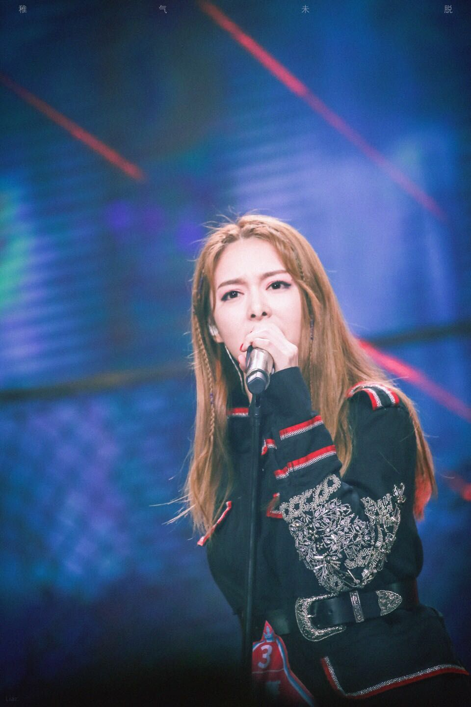
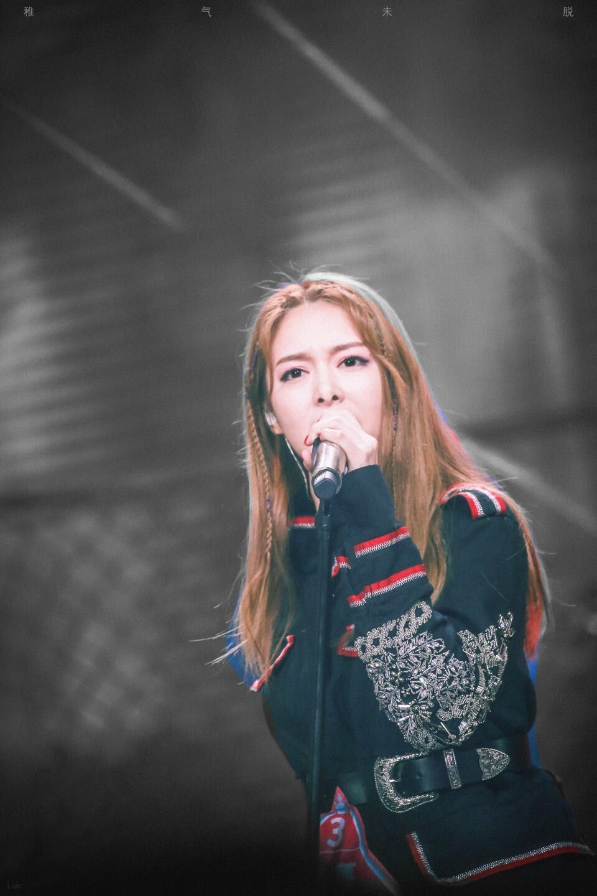
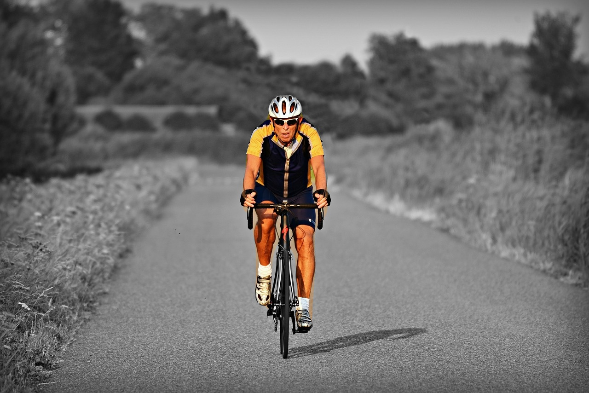
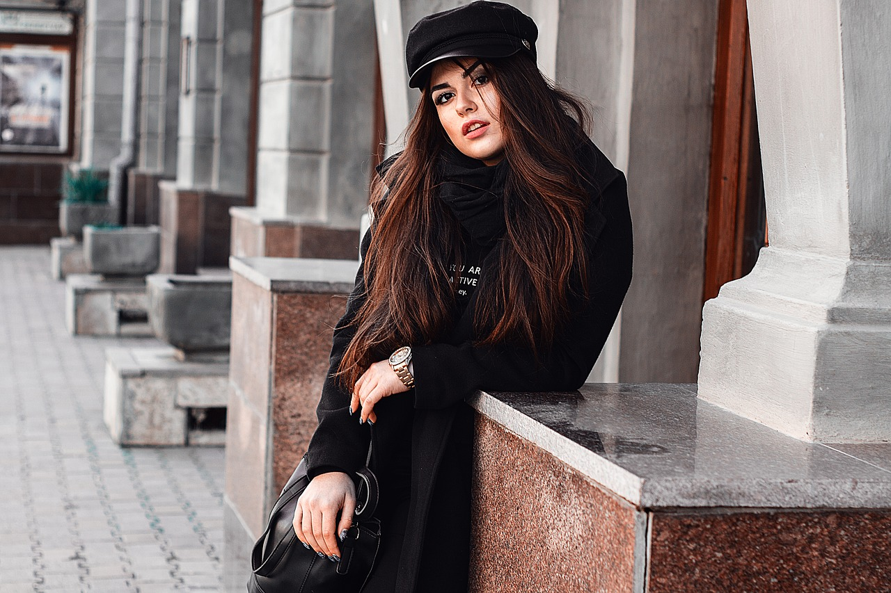
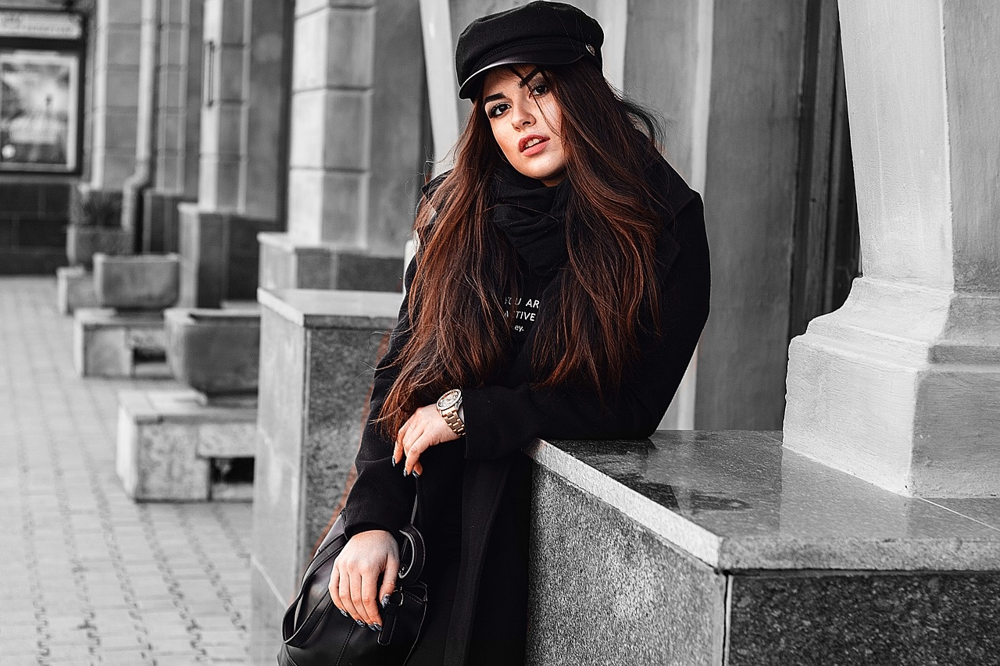
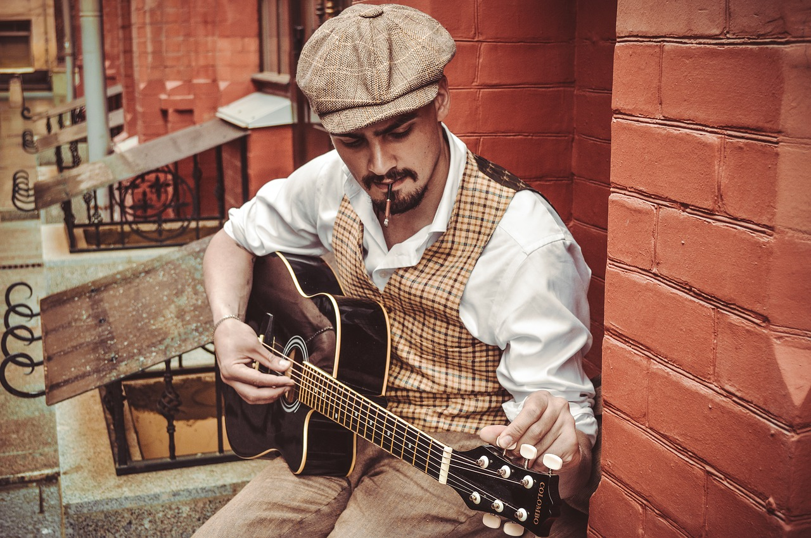
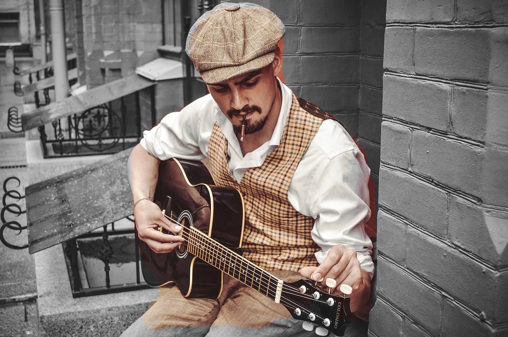
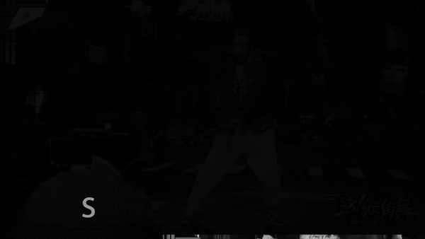

# Mask-RCNN Shiny

## Introduction

Original [Mask-RCNN](https://github.com/matterport/Mask_RCNN) is mainly used in object detection and scene segmentation. 

This project pays attention to another application: try to transfer the original colorful input file (support the input image or video includes at least a person) to the grayscale background while keeps the main character colorful. By using this project, the main character seems **Shiny** in the window. 

Here are some demo images:

|**Original Image 1**|**New Image 1**|**Original Image 2**|**New Image 2**|
| :--: | :--: | :--: | :--: |
|||||
|**Original Image 3**|**New Image 3**|**Original Image 4**|**New Image 4**|
|||||

Here are the demo gifs:

|**Demo 1**|**Demo 2**|
| :--: | :--: |
|||

#### For more information about this project, please watch the demo in YouTube: [Mask RCNN Shiny](https://www.youtube.com/watch?v=fRfFCMzEizo).

## Requirements

This project needs these packages to support:

numpy

scipy

cython

h5py

Pillow

scikit-image

tensorflow-gpu==1.8

keras==2.1.6

jupyter

matplotlib

imgaug

IPython[all]

opencv-python==3.4.1.15

## Usage

Before start, please download the mask_rcnn_coco.h5 file from the [released page](https://github.com/matterport/Mask_RCNN/releases) and put it in the main folder.

This project provides 2 Ipython notebooks for guidance. The Demo-Image file shows how to process an input image. The Demo-Video file shows how to process an input video. Both files include detailed annotation and explaination. You can execute them step by step easily.

For any question, please use the issue function or connect with hushiyu199510@gmail.com, thanks a lot!
